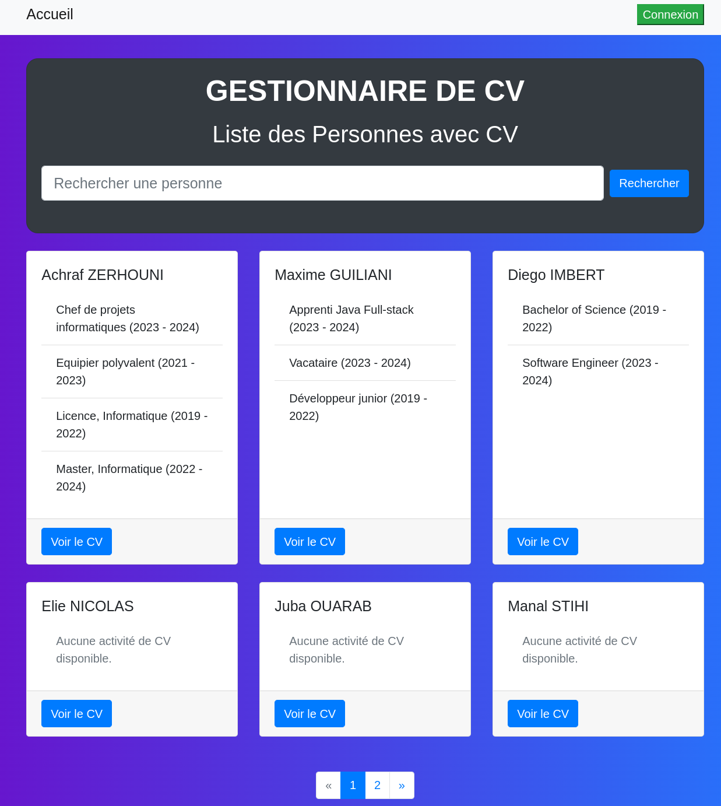
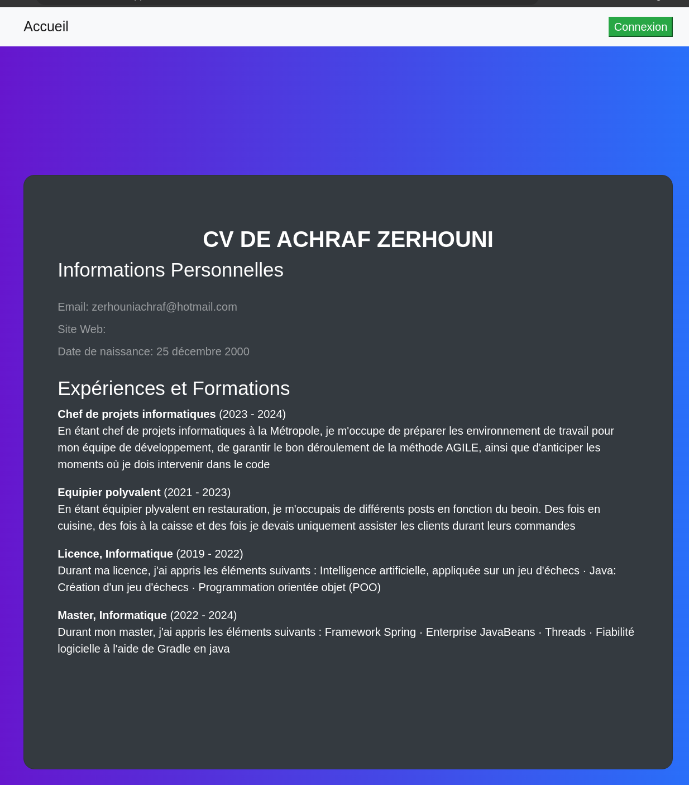
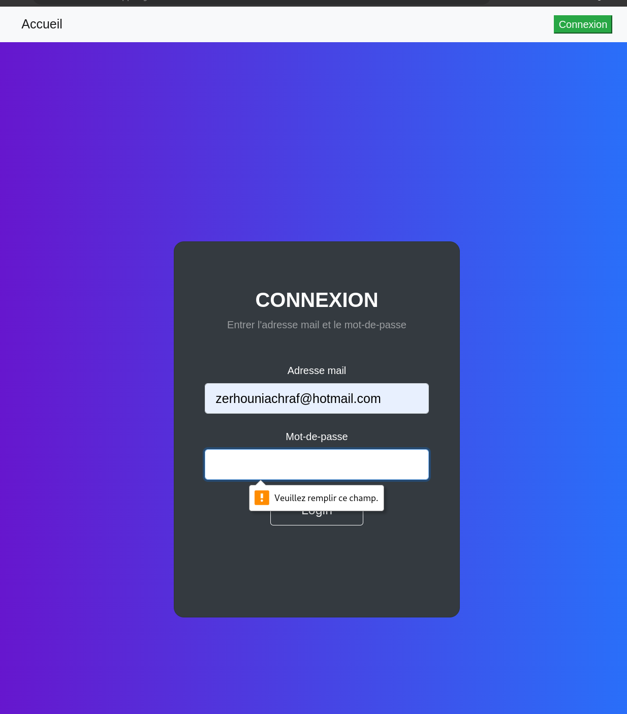
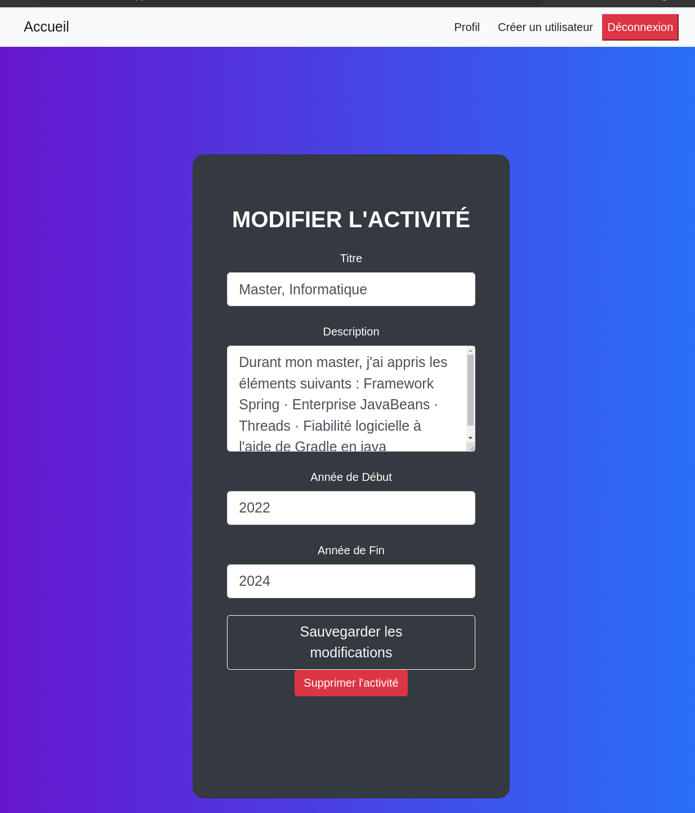

# Resume Manager

## Brief Description

This project is a comprehensive web application designed for managing resumes (CVs). It allows users to create and maintain their personal and professional information, education history, and work experiences in an organized and structured format.

## Prerequisites

To run this project, you need to have the following installed:

- Java (Version: 18)

## Running Tests

To run the automated tests for this project, execute the following command:
```bash
mvn test
```


This command will trigger all the unit and integration tests in the project, ensuring that all functionalities are working as expected.

## Tools and Technologies

This project is built using a variety of tools and technologies, including:

- **Spring Boot**: For creating the backend API and server-side logic.
- **Java EE (JEE)**: For the overall application framework and architecture.
- **Maven**: For dependency management and project build.
- **JUnit**: For writing and running unit tests.
- **Spring Security**: For securing the application and handling authentication and authorization.
- **Hibernate**: For object-relational mapping and database interaction.
- **MySQL**: As the primary database for storing application data.
- **Vue.js**: For building the interactive front-end user interface.
- **Bootstrap**: For styling and creating responsive web pages.
- **Axios**: For making HTTP requests from the frontend to the backend.

## Screenshots

Here are some screenshots from the Resume Manager application to give you a glimpse of its user interface and functionalities:

### Home Page
This is the landing page where users start their interaction with the application.


### User Resume Information
This page displays detailed information about a user's resume, including education and work experience.


### Login Page
Users need to log in to access their personal and secure resume management space.


### Modify Activity
This page allows users to edit or update their activities in the resume.



## Version

This is the initial version (1.0.0) of the project, marking the first major release with complete basic functionalities.

